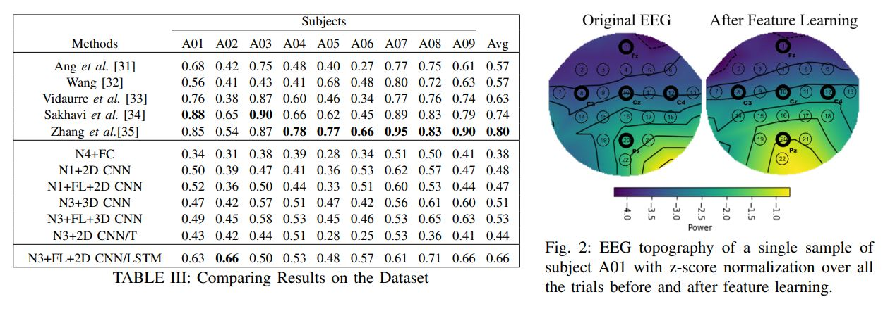

# # EEG-Based Brain Computer Interface
Spatio-temporal Representation Learning for EEG-based Brain-Computer Interfaces. In this project, we utilize Pytorch to build an end-to-end classification pipeline for Motor Imagery (MI) tasks using cross-subject data. 


##Evaluated Methods


##Results


## Installation

Use the package manager [pip](https://pip.pypa.io/en/stable/) to install Pytorch. 

```bash
pip install pytorch
```

## Usage
The default dataset for this project is ["BCI Competition IV"](http://www.bbci.de/competition/iv/). You can use your own dataset by adjusting the Get_Data module accordingly. Then, adjust the path as follows.
```python
'''Load the training data and test data'''
    Trials, Label= Get_Data(1,True, 'DataSet/')
    Trials_test, Label_test= Get_Data(1,False, 'DataSet/')  
```

## Contributing
Pull requests are welcome. For major changes, please open an issue first to discuss what you would like to change.

Please make sure to update tests as appropriate.

## License
Please reference the work when using this project.
